## Phishing Campaign Gallery

### Social Media Platform Phishing Campaigns

#### Telegram Phishing Campaign:

- Target: **Telegram**
- First-seen: 2026-05-28
- Last-seen: 2026-06-16
- Volume: 1441 domains
- Observation: This campaign conducts OAuth-style QR code session hijacking for account takeover. Fake Telegram QR login pages steal user sessions once scanned. Attackers seize compromised accounts to spread crypto and investment scams, with activity spiking during holiday seasons.

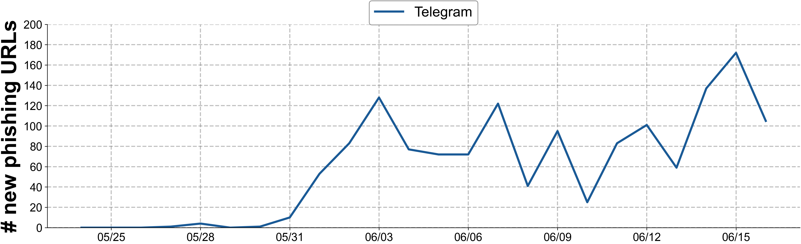 | 
:---: | :---:
Temporal Trend | Sample Screenshot 1

### E-Commerce & Retail Campaigns

#### TikTok Phishing Campaign:

- Target: **TikTok**
- First-seen: 2025-12-13
- Last-seen: 2026-01-05
- Volume: 10 domains
- Observation: On December 14, a TikTok phishing trend erupted, with the number of daily reports surging to 5. Although sporadic reports occurred afterward, it served as a warning of the persistent threat of phishing.

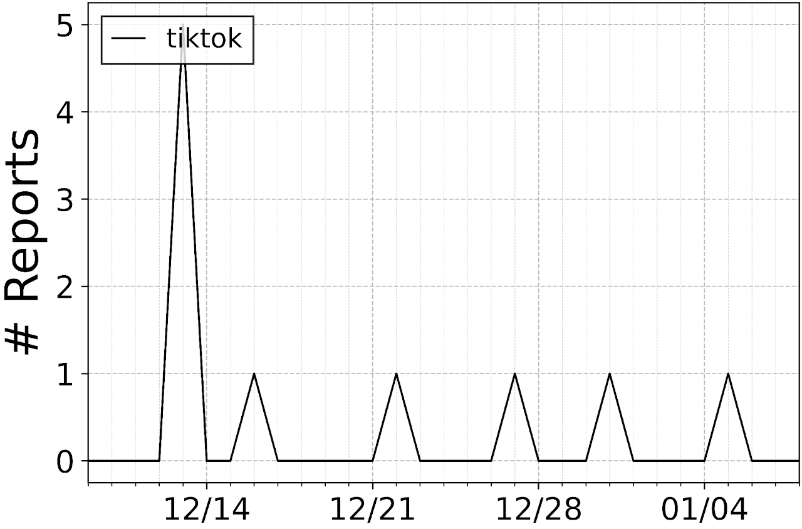 | 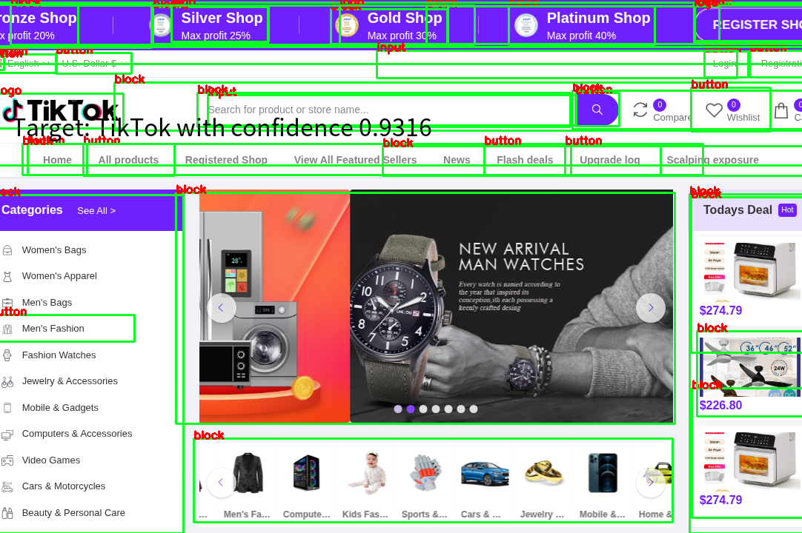 | 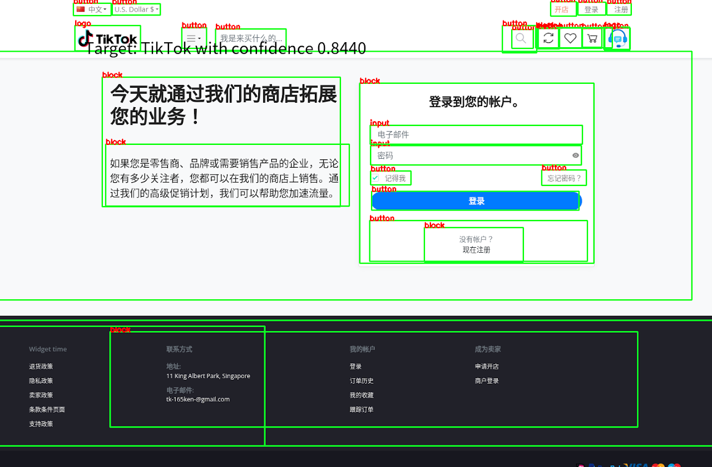
:---: | :---: | :---:
Temporal Trend | Sample Screenshot 1 | Sample Screenshot 2

#### Alibaba Phishing Campaign:

- Target: **Alibaba**
- First-seen: 2025-12-29
- Last-seen: 2026-01-08
- Volume: 12 domains
- Observation: Phishing reports targeting Alibaba remained at zero for a long time before December 28, followed by three significant spikes in late December and early January of the following year. This is likely related to the concentrated outbreak of phishing attacks by threat actors targeting consumers and merchants during the New Year shopping season.

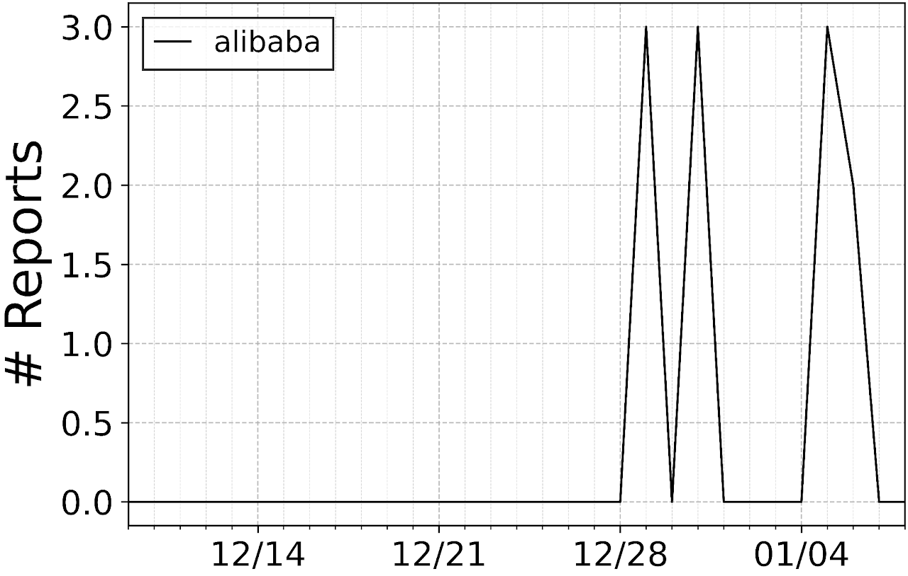 | 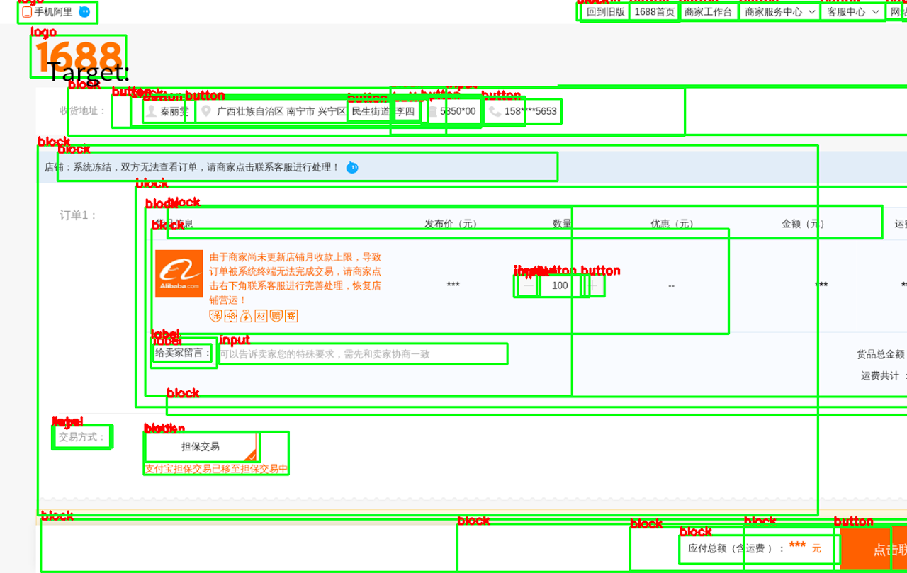
:---: | :---:
Temporal Trend | Sample screenshot

#### Walmart Phishing Campaign:

- Target: **Walmart**
- First-seen: 2025-12-13
- Last-seen: 2026-01-06
- Volume: 13 domains
- Observation: During the year-end promotion season, the number of counterfeit Walmart phishing websites suddenly surged to 6 on December 28, but the wave of attacks was quickly contained at the beginning of the year.

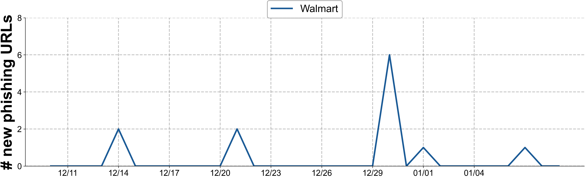 | 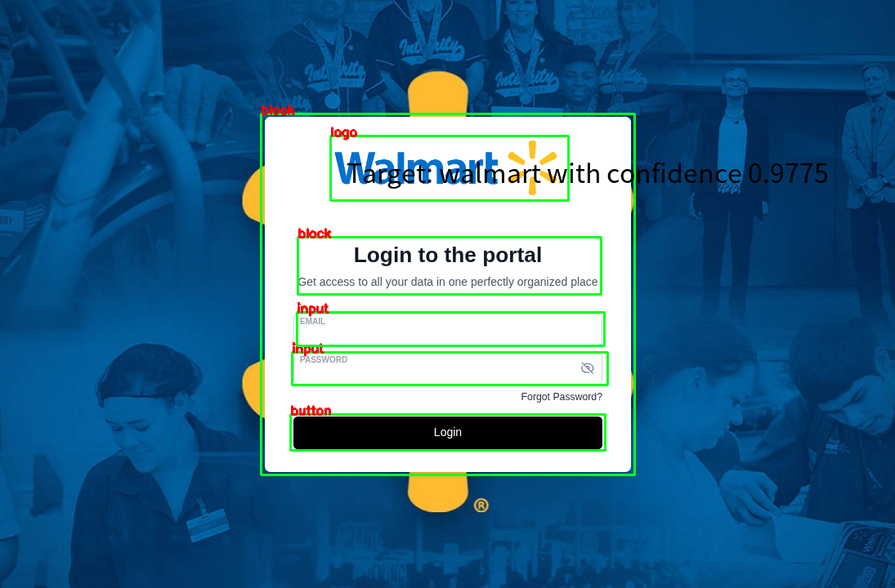 | 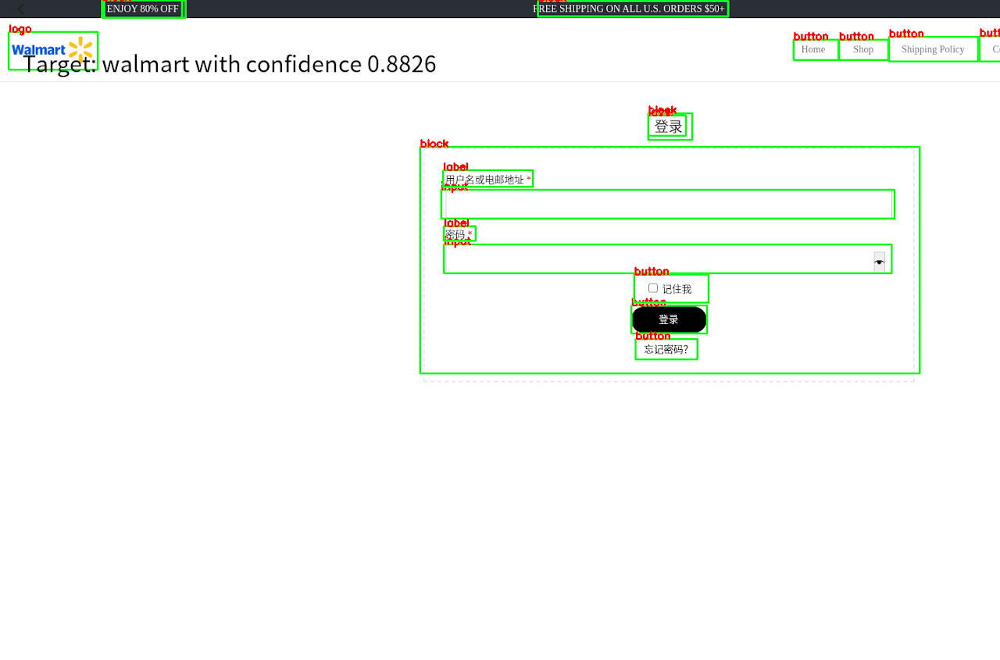
:---: | :---: | :---:
Temporal Trend | Sample Screenshot 1 | Sample Screenshot 2

### Financial Services Campaigns

#### CICC Phishing Campaign:

- Target: **China International Capital Corporation Limited (CICC)**
- First-seen: 2025-12-09
- Last-seen: 2026-01-04
- Volume: 16 domains
- Observation: In early December, there was a high-intensity pulse of "CICC" phishing attacks, with nearly 7 reports recorded in a single day. The attacks then subsided quickly, followed by a rebound in mid-December with 5 reports. After a nearly two-week quiet period, the activity resurfaced in early January of the following year, with 4 reports logged.

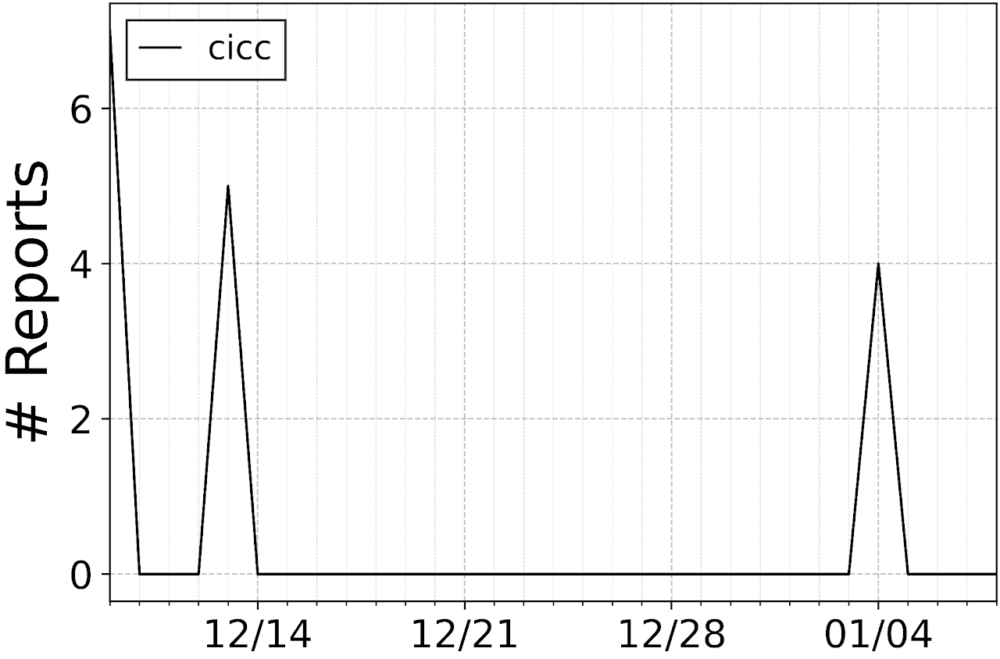 | 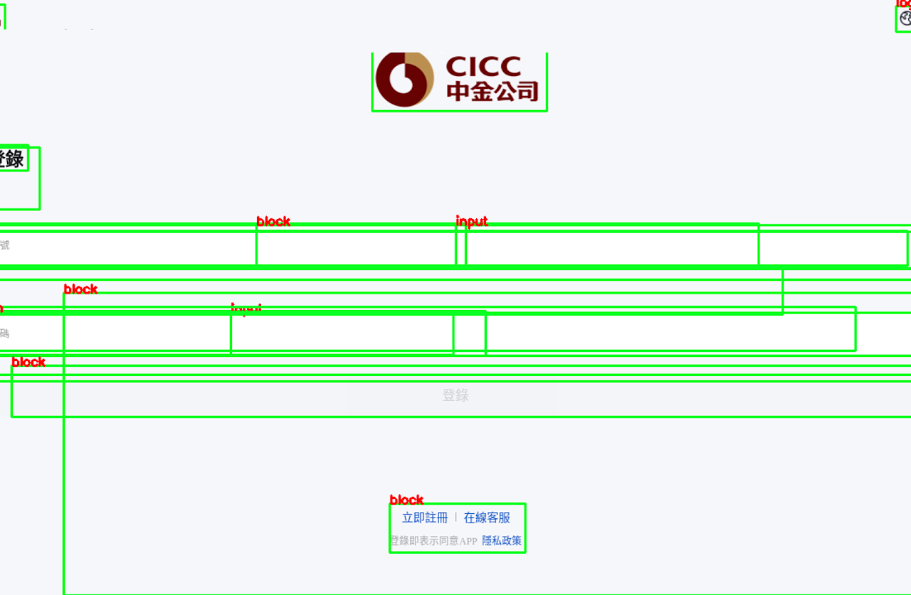
:---: | :---:
Temporal Trend | Sample screenshot

### Cloud Services & SaaS Campaigns

#### Gmail Phishing Campaign:

- Target: **Gmail**
- First-seen: 2025-12-13
- Last-seen: 2026-01-08
- Volume: 12 domains
- Observation: From mid-December to early January of the following year, Gmail phishing reports showed a cyclical pattern, with two peaks occurring around December 28 and early January, indicating the attackers' continuously evolving tactics.

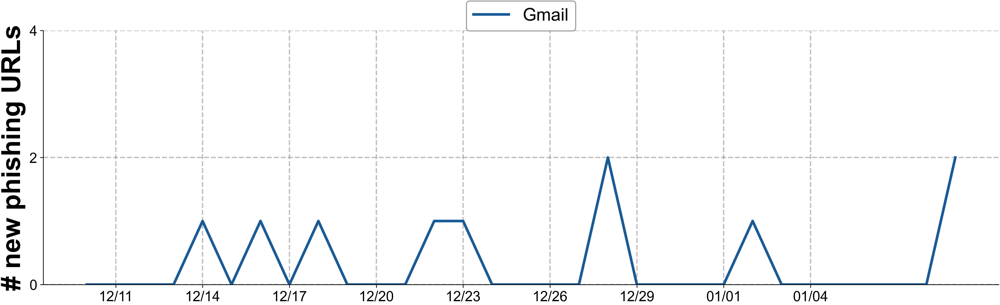 | 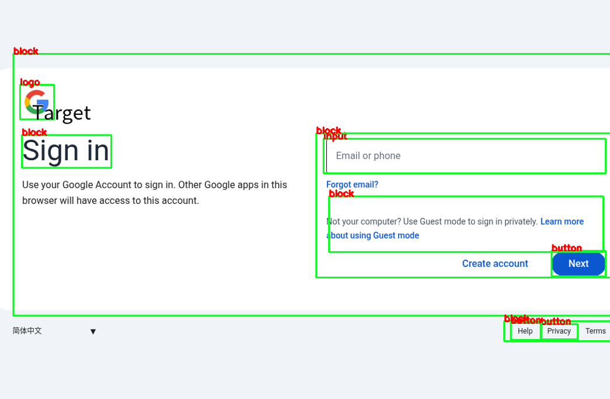
:---: | :---:
Temporal Trend | Sample screenshot

#### Orange Phishing Campaign:

- Target: **Orange**
- First-seen: 2025-12-09
- Last-seen: 2026-01-05
- Volume: 254 domains
- Observation: Attackers exploited three high-profile public announcements from Orange in early December 2025 (dividend payment, satellite SMS service launch, and MasOrange acquisition) by sending phishing emails and SMS messages impersonating official notifications, resulting in a sharp spike in phishing reports immediately after the events, which then declined as the news cycle faded.

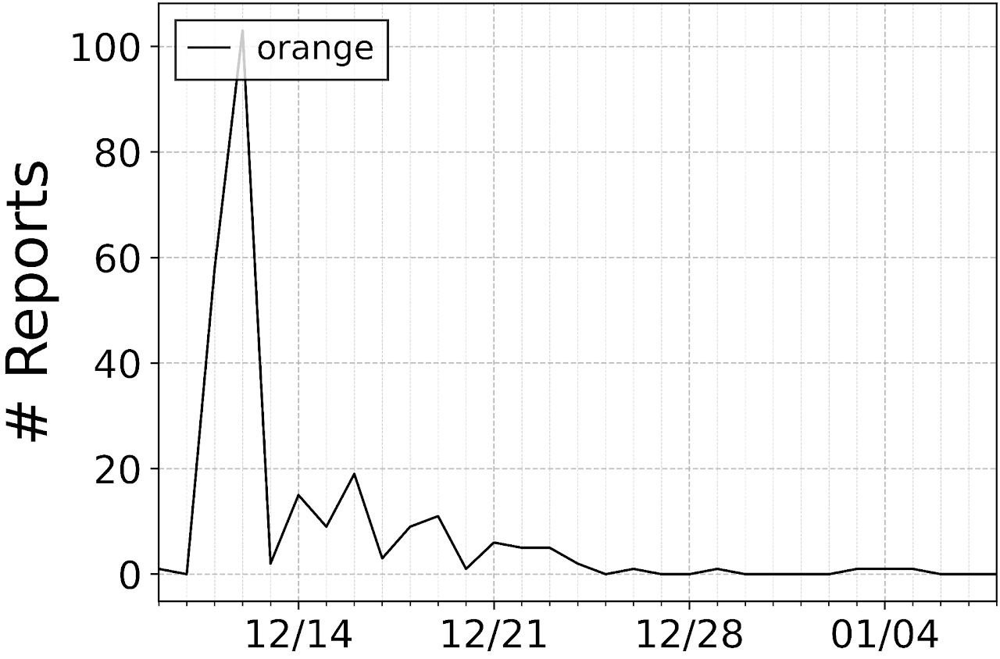 | 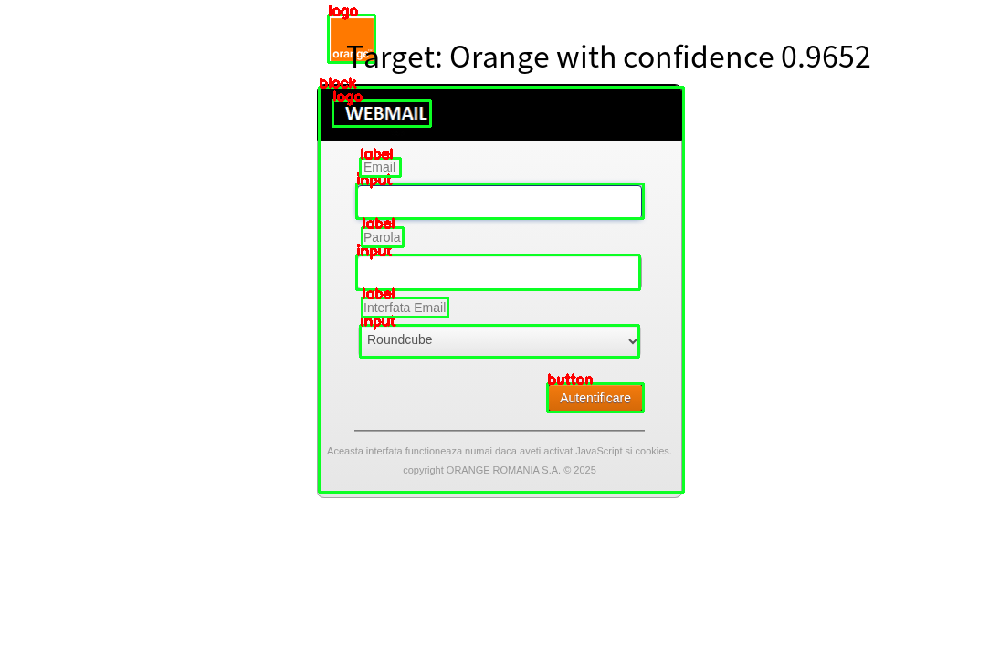
:---: | :---:
Temporal Trend | Sample screenshot

### Cryptocurrency & NFT Campaigns

#### Bybit Phishing Campaign:

- Target: **BYBIT**
- First-seen: 2025-12-12
- Last-seen: 2026-01-08
- Volume: 62 domains
- Observation: From late December to early January of the following year, there were two concentrated outbreaks of phishing activities targeting Bybit users. First, there was a small-scale probe at the end of December, which then quickly escalated into two distinct peaks in early January, with the number of reports exceeding 20 at one point before rapidly dropping back to near zero, like a wave of targeted attacks with a clear rhythm.

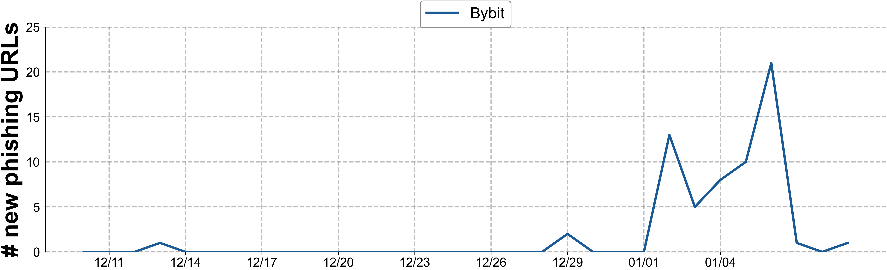 | 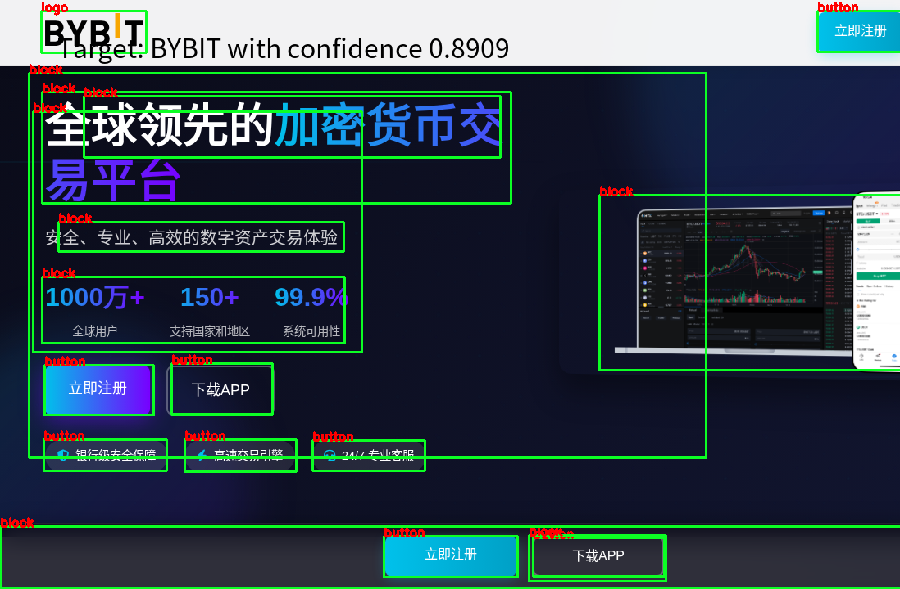
:---: | :---:
Temporal Trend | Sample screenshot

## Phishing Output Demo

### Reported by the Positive Channel

**Domains are reported through the positive channel because the fast thinker recognizes the domain pattern as phishing, likely because they have seen phishing domains from this campaign before.**

#### Example 1: opensea-n7n.pages.dev

- Target: **Opensea**
- Fast thinker classification score: **0.90**
- Reason: **The feature "opensea-" had already appeared on 2025-12-09, so it was classified as positive by the fast thinker classifier.**

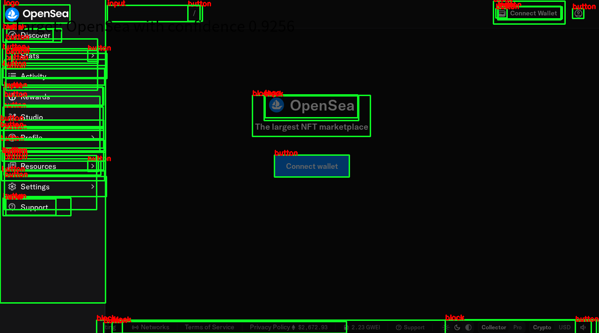

#### Example 2: ihvzpz2.qdkheu.top

- Target: **Huatai Securities**
- Fast thinker classification score: **0.92**
- Reason: **The domain "qdkheu.top" had already appeared on 2025-12-17 and 2025-12-18, so it was classified as positive by the fast thinker classifier.**

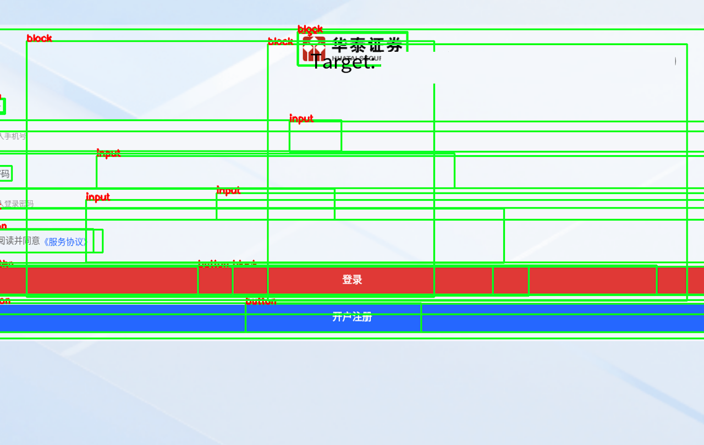

#### Example 3: ciccdijd932jjd2o.bib-btc.vip

- Target: **CICC**
- Fast thinker classification score: **0.75**
- Reason: **The feature "ciccdijd932jjd2o.bib-btc" had already appeared on 2025-12-09, and it only changed the top-level domain, so it was classified as positive by the fast thinker classifier.**

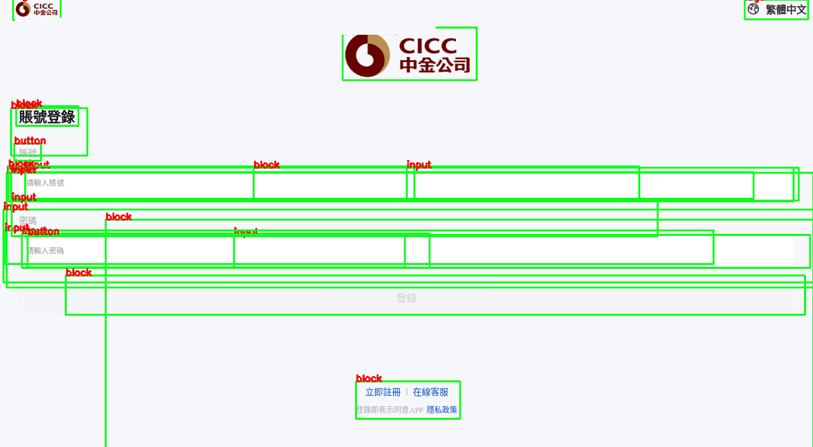

#### Example 4: adsgoogle.partner-verification-center.com

- Target: **Gmail**
- Fast thinker classification score: **0.63**
- Reason: **The feature "google" had already appeared on 2025-12-15 and 2025-12-17. The feature "verification" had already appeared on 2025-12-17 and 2025-12-21. So it was classified as positive by the fast thinker classifier.**

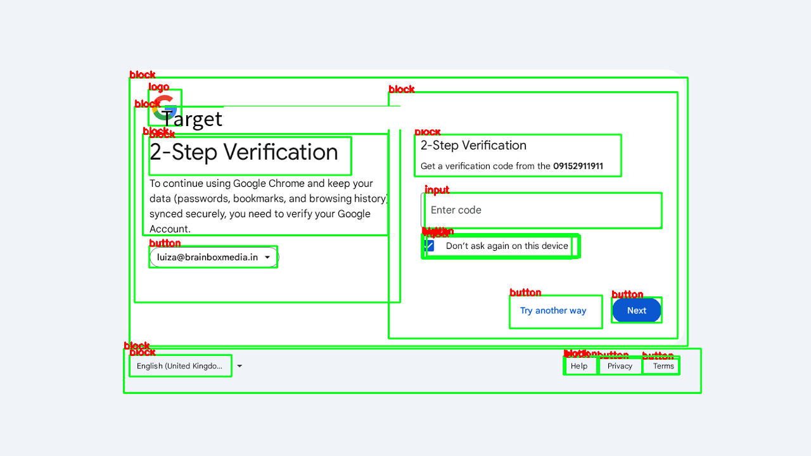

#### Example 5: 99nightsintheforestdeerplushie.com

- Target: **Roblox**
- Fast thinker classification score: **0.72**
- Reason: **The feature "99nights" had already appeared on 2025-12-31 and 2026-01-01. So it was classified as positive by the fast thinker classifier.**

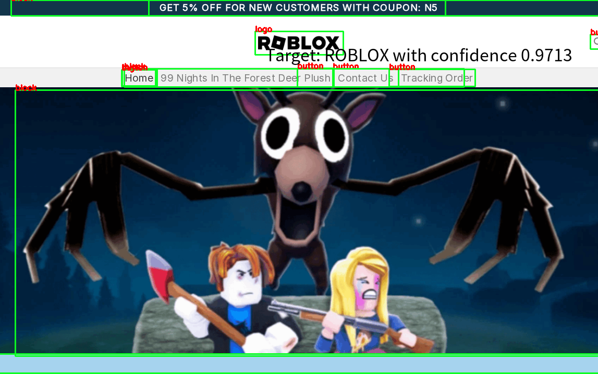

### Reported by the High-uncertainty Channel

Domains are reported through the uncertainty channel because the domain falls near the fast thinker's decision boundary. This is likely because the lexical pattern is novel, making the classification ambiguous.

#### Example 1: elk-3nl.pages.dev

- Target: **Walmart**
- Fast thinker classification score: **0.16**
- Reason: **On 2026-01-06, this type of domain appeared for the first time in the campaign.**

#### Example 2: mail.mgg-remat.com.ro

- Target: **Orange**
- Fast thinker classification score: **0.35**
- Reason: **On 2025-12-09, a domain of the type "mail.xxxx.ro" appeared for the first time in this campaign.**

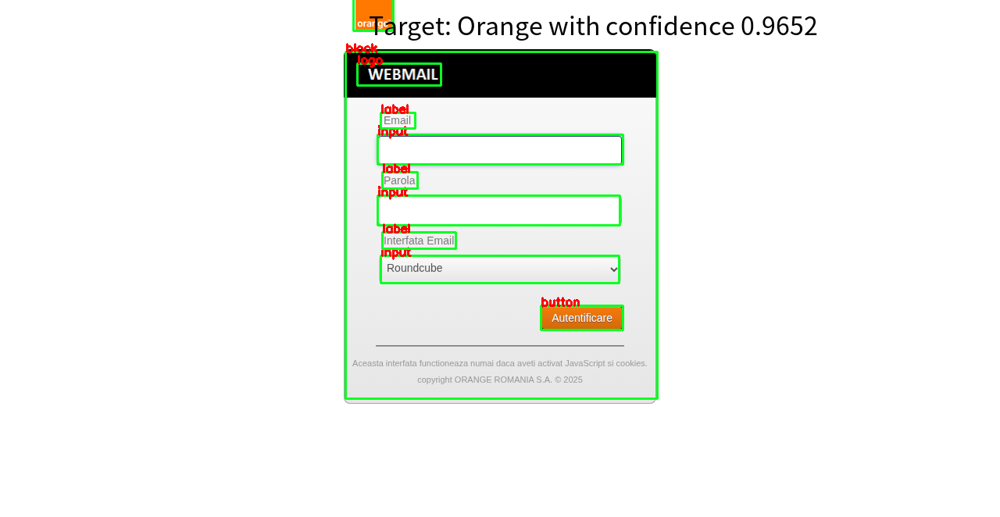

#### Example 3: www.tiktshopp.cc

- Target: **Tiktok**
- Fast thinker classification score: **0.49**
- Reason: **On 2025-12-13, a domain of the type "tiktshopp.xxx" appeared for the first time in this campaign.**

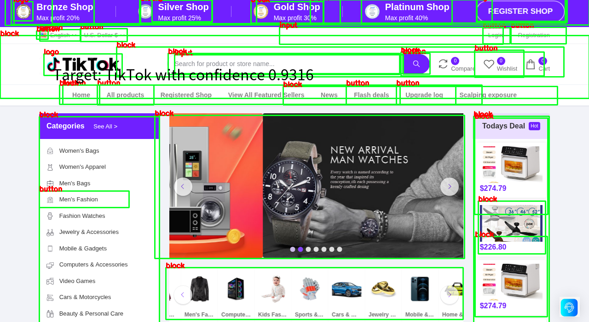

### Reported by the Typosquatting Channel

**Domains are reported through the typosquatting channel. Based on their lexical distribution, they are close to the benign class, so they cannot be ranked by either the positive or high-uncertainty channels. We therefore design a dedicated typosquatting model to identify these special cases.**

#### Example 1: www.1688.com.lszzkb.com

- Target: **Alibaba**
- Fast thinker classification score: **0.32**
- Reason: **The official domain is www.1688.com. This domain is relatively similar to the official one and uses a subdomain misuse technique.**

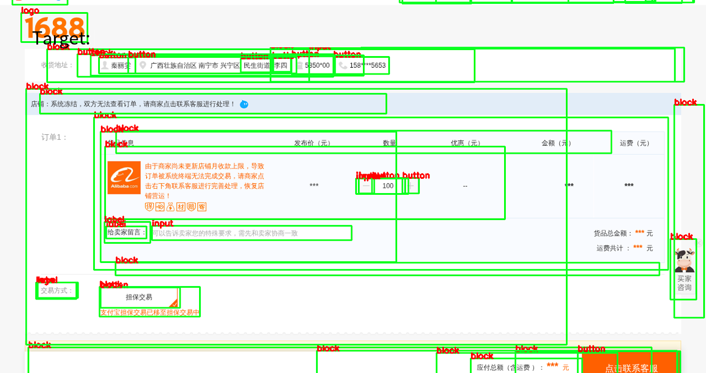

#### Example 2: sf-express-com-hkq6.top

- Target: **SF Express**
- Fast thinker classification score: **0.39**
- Reason: **The official domain is sf-express.com. This domain is relatively similar to the official one and uses a hyphen insertion + TLD substitution technique.**

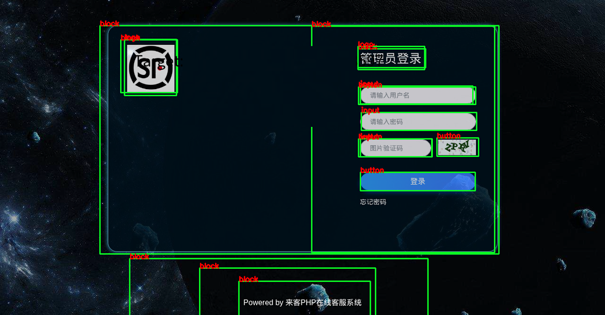

#### Example 3: netflix.avdhoothadke.com

- Target: **Netflix**
- Fast thinker classification score: **0.37**
- Reason: **Netflix's official domain is netflix.com. This domain is relatively similar to the official one and uses a subdomain misuse technique.**

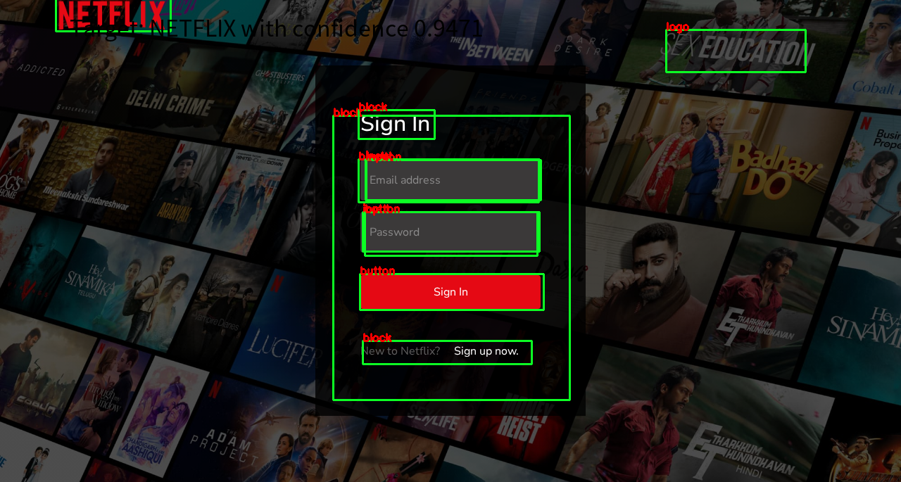

#### Example 4: whatsaqq.net

- Target: **WhatsApp**
- Fast thinker classification score: **0.38**
- Reason: **The official domain of WhatsApp is whatsapp.com. The domain uses a character replacement + TLD substitution technique, replacing the double "pp" in "whatsapp" with visually similar "qq", combined with TLD substitution (.com -> .net).**

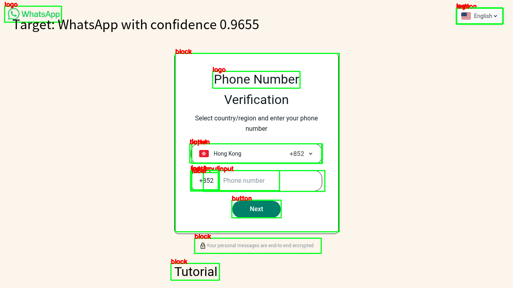